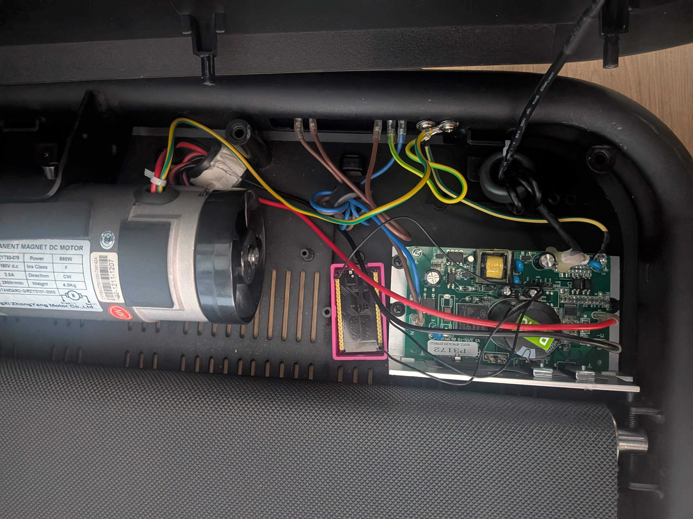

# Uvero U1 → Garmin BLE Bridge

Connect a **Uvero U1** treadmill (and similar Chinese OEM treadmills — Sperax, Deerrun, PitPat) to a **Garmin watch** via Bluetooth as a native foot pod (BLE RSC). Shows real-time pace and distance during a running activity — no app required.

---



## How it works

The treadmill console sends speed data over a 2400-baud UART line. An ESP32 reads this line, decodes the proprietary packet format, and re-broadcasts it as a standard BLE Running Speed & Cadence (RSC) sensor that Garmin watches recognize natively.

A WiFi dashboard is also served over HTTP for monitoring.

```
Treadmill UART  →  ESP32  →  BLE RSC  →  Garmin Fenix / Forerunner / etc.
                      └──────→  WiFi HTTP dashboard (browser)
```

**Tested with:** Garmin Fenix 7X Pro. Should work with any Garmin that supports foot pods (RSC profile).

---

## Hardware

| Part | Notes |
|------|-------|
| ESP32 DevKit (38-pin) | Any standard ESP32 DevKit |
| 3D-printed case | [MakerWorld: ESP32 38-pin case](https://makerworld.com/pl/models/1029542-esp32-case-38-pin-customize-or-ready-print?from=search#profileId-1016748) |
| 3 wires | To tap the treadmill UART |

---

## Wiring

Open the treadmill console cover and locate the UART connector:

```
Treadmill VIN ──────────► ESP32 VIN   (not 3V3 — needs regulator for WiFi current peaks)
Treadmill GND ──────────► ESP32 GND
Treadmill TX  ──────────► ESP32 GPIO16 (RX2)
```

> **Warning:** Use `VIN`, not `3V3`. The treadmill's 3V3 rail cannot source the ~300–500 mA peaks that WiFi requires. The ESP32's VIN pin goes through the onboard regulator.

> **Warning:** When flashing, disconnect the treadmill from mains before connecting USB, or disconnect the VIN wire first.

---

## Setup

### 1. Configure WiFi credentials

The pre-built firmware in `firmware/` has **no WiFi credentials** — the dashboard won't connect to your network. To use the dashboard, you need to build from source (see below). The BLE RSC function works without WiFi regardless.

To build with your credentials, edit `esp32/src/main.cpp`:

```cpp
#define WIFI_SSID "your-network"
#define WIFI_PASS "your-password"
```

### 2. Flash — pre-built binary (no tools required except esptool)

Install esptool if you don't have it:

```bash
pip install esptool
```

Then flash all three files:

```bash
esptool.py --chip esp32 --baud 460800 \
  write_flash \
  0x1000  firmware/bootloader.bin \
  0x8000  firmware/partitions.bin \
  0x10000 firmware/firmware.bin
```

### 2b. Flash — build from source (with WiFi)

Requires [PlatformIO](https://platformio.org/):

```bash
cd esp32
pio run -t upload
```

If the ESP32 is powered from the treadmill (not USB), enter bootloader manually:
hold **BOOT**, press **EN**, release **EN**, release **BOOT** — then run upload.

### 3. Pair with Garmin

On your Garmin watch: **Settings → Sensors → Add Sensor → Foot Pod** → it should find "Uvero U1".

### 4. Dashboard

Open `http://<ESP32-IP>` in a browser. The IP is printed to serial on boot.

---

## Supported speeds

All speeds from **1.1 to 4.0 km/h** are supported (31 LUT entries). Speeds above 4.1 km/h were not captured due to child lock on the test unit.

---

## Protocol documentation

The treadmill uses a proprietary half-duplex UART protocol. Full reverse-engineering notes, packet format, byte encoding, and — critically — **why bytes seen by a CP210x USB adapter differ from bytes seen by an ESP32 directly on the bus** (half-duplex collision zones):

- [docs_en.md](docs_en.md) — English
- [docs.md](docs.md) — Polish

This collision zone difference is not documented anywhere else for this protocol family. If you are building a similar integration for a Sperax/Deerrun/PitPat treadmill, read that section before building your lookup table.

---

## Project structure

```
firmware/
  bootloader.bin   — flash at 0x1000
  partitions.bin   — flash at 0x8000
  firmware.bin     — flash at 0x10000 (no WiFi credentials)
esp32/
  src/
    main.cpp   — firmware: UART parser, BLE RSC, WiFi dashboard
    lut.h      — speed lookup table (31 entries, 1.1–4.0 km/h)
  platformio.ini
docs_en.md     — full protocol docs (English)
docs.md        — full protocol docs (Polish)
```
